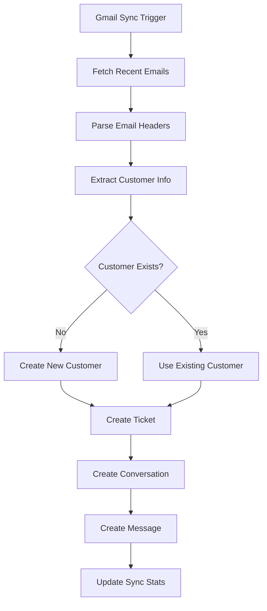

# Zynlo Helpdesk 🎫

Een modern ticketsysteem geïnspireerd door Trengo, gebouwd met cutting-edge technologieën voor optimale performance en schaalbaarheid.


## ✨ Features

- **📧 Gmail Integration**: Volledige email-naar-ticket conversie met OAuth2
- **📬 Multi-channel Support**: Email, WhatsApp, Chat integratie
- **🎯 Intelligent Ticket Routing**: Automatische ticket toewijzing
- **👥 Team Collaboration**: Interne notities en team management
- **🏷️ Label System**: Flexibele categorisatie van tickets
- **📊 Real-time Updates**: Live updates via WebSockets
- **🔍 Advanced Search**: Full-text search met filters
- **📱 Responsive Design**: Werkt perfect op alle apparaten
- **🔒 Enterprise Security**: Row Level Security (RLS) met Supabase

## 🆕 Recent Updates

### ✅ Gmail Integration Voltooid (December 2024)

- **Email-to-Ticket Conversie**: Automatische conversie van emails naar tickets
- **OAuth2 Authentication**: Veilige Gmail account koppeling
- **Smart Customer Management**: Automatische klant detectie en aanmaak
- **Duplicate Detection**: Voorkomt dubbele ticket creatie
- **Real-time Sync**: Live email synchronisatie met Gmail API
- **Push Notifications**: Instant email sync via Google Cloud Pub/Sub (< 1 seconde)
- **Comprehensive Metadata**: Behoudt alle email headers en content

### 🔧 Technische Verbeteringen

- Volledige Next.js API route implementatie
- Database schema voor OAuth token storage
- Robuuste error handling en logging
- Token refresh mechanisme
- Channel management interface

## 🚀 Tech Stack

### Frontend

- **Next.js 14** - React framework met App Router
- **TypeScript** - Type-safe development
- **Tailwind CSS** - Utility-first CSS framework
- **Radix UI** - Toegankelijke UI componenten
- **React Query** - Data synchronisatie

### Backend

- **Supabase** - PostgreSQL database & Auth
- **Gmail API** - Email synchronisatie en OAuth2
- **Edge Functions** - Serverless functies

### Integraties

- **Google OAuth2** - Gmail account authenticatie
- **Gmail API v1** - Email fetching en real-time sync
- **Automated Token Management** - Refresh token handling

### Development

- **Turborepo** - Monorepo management
- **pnpm** - Snelle package manager
- **ESLint & Prettier** - Code quality

## 📦 Project Structuur

```
zynlo-helpdesk/
├── apps/
│   ├── dashboard/          # Next.js frontend applicatie
│   └── api-server/         # Express webhook server
├── packages/
│   ├── ui/                 # Gedeelde UI componenten
│   ├── supabase/          # Database types & hooks
│   └── utils/             # Gedeelde utilities
├── supabase/
│   ├── migrations/        # Database migraties
│   └── functions/         # Edge Functions
└── docs/                  # Documentatie
```

## 🛠️ Installatie

### Vereisten

- Node.js 18+
- pnpm 8+
- Supabase account
- (Optioneel) Docker voor lokale Supabase

### Setup

1. **Clone de repository**

   ```bash
   git clone https://github.com/Garage-loyalty/zynlo.git
   cd zynlo
   ```

2. **Installeer dependencies**

   ```bash
   pnpm install
   ```

3. **Configureer environment variables**

   ```bash
   cp apps/dashboard/.env.example apps/dashboard/.env.local
   cp apps/api-server/.env.example apps/api-server/.env.local
   ```

4. **Setup Supabase**

   ```bash
   # Start lokale Supabase (optioneel)
   npx supabase start

   # Of gebruik Supabase cloud en voer migraties uit
   npx supabase db push
   ```

5. **Start development servers**
   ```bash
   pnpm dev
   ```

## 🔧 Configuratie

### Environment Variables

#### Dashboard (`apps/dashboard/.env.local`)

```env
NEXT_PUBLIC_SUPABASE_URL=your-supabase-url
NEXT_PUBLIC_SUPABASE_ANON_KEY=your-supabase-anon-key
NEXT_PUBLIC_APP_URL=http://localhost:3000

# Gmail Integration (Required voor email sync)
GOOGLE_CLIENT_ID=your-google-oauth-client-id
GOOGLE_CLIENT_SECRET=your-google-oauth-client-secret
SUPABASE_SERVICE_ROLE_KEY=your-supabase-service-role-key
```

#### Vercel Environment Variables

Voor productie deployment in Vercel:

```env
NEXT_PUBLIC_SUPABASE_URL=your-supabase-url
NEXT_PUBLIC_SUPABASE_ANON_KEY=your-supabase-anon-key
GOOGLE_CLIENT_ID=your-google-oauth-client-id
GOOGLE_CLIENT_SECRET=your-google-oauth-client-secret
SUPABASE_SERVICE_ROLE_KEY=your-supabase-service-role-key
```

## 📧 Gmail Integration Setup

### 1. Google Cloud Console Setup

1. Ga naar [Google Cloud Console](https://console.cloud.google.com)
2. Maak een nieuw project of selecteer een bestaand project
3. Ga naar "APIs & Services" → "Credentials"
4. Maak een OAuth 2.0 Client ID:
   - Application type: Web application
   - Authorized redirect URIs:
     - `http://localhost:3000/api/auth/gmail/callback` (development)
     - `https://your-domain.vercel.app/api/auth/gmail/callback` (production)

### 2. Database Setup

De oauth_tokens tabel wordt automatisch aangemaakt via migrations:

```sql
-- Zie: supabase/migrations/20241221000000_create_oauth_tokens.sql
-- Zie: supabase/migrations/20241221000001_update_channels_add_created_by.sql
```

### 3. Gmail Account Koppelen

1. Ga naar "Kanalen" in je helpdesk
2. Klik op "Email Kanaal Toevoegen"
3. Kies "Gmail" als provider
4. Klik "Koppel Gmail Account"
5. Voltooi de OAuth flow
6. Test de sync met "Sync Nu"

### 4. Email-naar-Ticket Proces



## 🔌 Integraties

### Email Setup ✅ Compleet

- **Gmail API Integration**: Volledig geïmplementeerd
- **OAuth2 Flow**: Veilige account koppeling
- **Real-time Sync**: Automatische email-naar-ticket conversie
- **Customer Management**: Auto-detect en creatie van klanten
- **Duplicate Prevention**: Voorkomt dubbele ticket processing

Zie [EMAIL_INTEGRATION.md](docs/EMAIL_INTEGRATION.md) voor gedetailleerde technische documentatie.

### WhatsApp Setup (Geplanned)

1. Configureer Twilio account
2. Set webhook URL naar `https://your-domain.com/api/webhooks/whatsapp`
3. Voeg credentials toe aan environment variables

## 🚀 Deployment

### Vercel (Aanbevolen)

1. Connect GitHub repository (`zynlo-helpdesk-fixed`)
2. Configure environment variables (zie bovenstaande lijst)
3. Deploy met één klik
4. Test Gmail integration na deployment

### Troubleshooting Gmail Integration

**"Gmail tokens niet gevonden":**

- Check of OAuth flow is voltooid
- Verifieer GOOGLE_CLIENT_ID en GOOGLE_CLIENT_SECRET
- Controleer redirect URIs in Google Cloud Console

**"Token refresh failed":**

- Check of refresh token bestaat in database
- Verifieer SUPABASE_SERVICE_ROLE_KEY is ingesteld
- Re-koppel Gmail account indien nodig

**Emails worden niet gesynchroniseerd:**

- Check Supabase logs in dashboard
- Verifieer dat channel status "Verbonden" toont
- Test sync handmatig via "Sync Nu" knop

### Docker

```bash
docker-compose up -d
```

## 📚 Documentatie

- [Architectuur Overzicht](docs/ARCHITECTURE.md)
- [Database Structuur](docs/DATABASE_STRUCTURE.md)
- [API Documentatie](docs/API.md)
- [Cursor AI Tips](docs/CURSOR_TIPS.md)

## 🤝 Contributing

Bijdragen zijn welkom! Zie onze [Contributing Guidelines](CONTRIBUTING.md).

## 📄 Licentie

Dit project is gelicentieerd onder de MIT License - zie het [LICENSE](LICENSE) bestand voor details.

## 🙏 Credits

- Geïnspireerd door [Trengo](https://trengo.com)
- Gebouwd met ❤️ door het Garage Loyalty team

---

**Need help?** Open een [issue](https://github.com/Garage-loyalty/zynlo/issues) of join onze [Discord](https://discord.gg/zynlo).

## 🚀 Deployment naar Vercel

### Prerequisites

- Vercel account
- GitHub repository
- Supabase project

### Stap 1: Voorbereiding

1. Zorg dat alle code gecommit is:

```bash
git add .
git commit -m "Prepare for Vercel deployment"
git push
```

2. Controleer dat de build lokaal werkt:

```bash
pnpm build
```

### Stap 2: Vercel Setup

1. Ga naar [vercel.com](https://vercel.com) en log in
2. Klik op "New Project"
3. Importeer je GitHub repository
4. Configureer het project:
   - **Framework Preset**: Next.js
   - **Root Directory**: `apps/dashboard`
   - **Build Command**: `cd ../.. && pnpm build`
   - **Install Command**: `pnpm install --frozen-lockfile`

### Stap 3: Environment Variables

Voeg de volgende environment variables toe in Vercel:

**Required:**

- `NEXT_PUBLIC_SUPABASE_URL` - Je Supabase project URL
- `NEXT_PUBLIC_SUPABASE_ANON_KEY` - Je Supabase anon key
- `SUPABASE_SERVICE_ROLE_KEY` - Je Supabase service role key

**Optional (voor extra features):**

- `GOOGLE_CLIENT_ID` - Voor Gmail integratie
- `GOOGLE_CLIENT_SECRET` - Voor Gmail integratie
- `EMAIL_WEBHOOK_SECRET` - Voor email webhook beveiliging

### Stap 4: Deploy

1. Klik op "Deploy"
2. Wacht tot de build compleet is
3. Je applicatie is nu live op `https://your-project.vercel.app`

### Troubleshooting

**Build faalt met "exit code 2":**

- Check of alle environment variables zijn ingesteld
- Controleer de build logs voor specifieke errors
- Zorg dat `typescript.ignoreBuildErrors: true` in `next.config.js` staat (tijdelijke fix)

**"Module not found" errors:**

- Run `pnpm clean && pnpm install` lokaal
- Commit de `pnpm-lock.yaml` file
- Push naar GitHub en trigger een nieuwe deploy

**Database connection errors:**

- Controleer of de Supabase URL en keys correct zijn
- Check of je Supabase project actief is
- Verifieer dat de database migrations zijn uitgevoerd

## 📝 Development Commands

```bash
# Development
pnpm dev              # Start alle services
pnpm dev:dashboard    # Start alleen dashboard
pnpm dev:api         # Start alleen API server

# Build & Production
pnpm build           # Build alle packages
pnpm start           # Start production servers
pnpm clean           # Clean build caches

# Database
pnpm supabase:start  # Start lokale Supabase
pnpm supabase:types  # Genereer TypeScript types

# Code Quality
pnpm lint            # Run linter
pnpm type-check      # Check TypeScript
pnpm format          # Format code
```

## 🤝 Contributing

1. Fork het project
2. Create je feature branch (`git checkout -b feature/AmazingFeature`)
3. Commit je changes (`git commit -m 'Add some AmazingFeature'`)
4. Push naar de branch (`git push origin feature/AmazingFeature`)
5. Open een Pull Request

## 📄 License

Dit project is gelicenseerd onder de MIT License.

## 🙏 Acknowledgments

- Geïnspireerd door [Trengo](https://trengo.com)
- Gebouwd met [Next.js](https://nextjs.org)
- Powered by [Supabase](https://supabase.com)

## 📝 Development Workflow

### Commands

```bash
# Development
pnpm dev              # Start alle services
pnpm dev:dashboard    # Start alleen dashboard

# Build & Production
pnpm build           # Build alle packages
pnpm start           # Start production servers
pnpm clean           # Clean build caches

# Database
pnpm supabase:start  # Start lokale Supabase
pnpm supabase:types  # Genereer TypeScript types

# Code Quality
pnpm lint            # Run linter
pnpm type-check      # Check TypeScript
pnpm format          # Format code
```

### Git Workflow

**⚡ Quick Check**: Run `.\scripts\check-git-setup-simple.ps1` (Windows) or `./scripts/check-git-setup.sh` (Mac/Linux) om je Git configuratie te verifiëren.

1. Maak een feature branch: `git checkout -b feature/nieuwe-feature`
2. Commit changes: `git commit -m "feat: beschrijving"`
3. Push branch: `git push origin feature/nieuwe-feature`
4. Open een Pull Request

**📖 Detailed Git Setup**: Zie [GIT_SETUP.md](docs/GIT_SETUP.md) voor complete instructies en troubleshooting.

## 📚 Documentatie

- [Architectuur Overzicht](docs/ARCHITECTURE.md)
- [Database Setup](docs/DATABASE_SETUP.md)
- [Email Integration](docs/EMAIL_INTEGRATION.md)
- [Project Status](docs/PROJECT_STATUS.md)
- [Git Setup Guide](docs/GIT_SETUP.md)

## 🚀 Deployment naar Vercel

### Prerequisites

- Vercel account gekoppeld aan GitHub
- Supabase project met migraties uitgevoerd
- Google Cloud Console OAuth2 credentials

### Stap 1: Repository Setup

1. Zorg dat alle code gecommit is:

```bash
git add .
git commit -m "Prepare for Vercel deployment"
git push origin main
```

2. Controleer dat de build lokaal werkt:

```bash
pnpm build
```

### Stap 2: Vercel Configuration

1. Ga naar [vercel.com](https://vercel.com) en log in
2. Klik op "New Project"
3. Importeer je GitHub repository (`zynlo-helpdesk-fixed`)
4. Configureer het project:
   - **Framework Preset**: Next.js
   - **Root Directory**: `apps/dashboard`
   - **Build Command**: `cd ../.. && pnpm build`
   - **Install Command**: `pnpm install --frozen-lockfile`

### Stap 3: Environment Variables

Voeg alle environment variables toe uit de configuratie sectie hierboven.

### Stap 4: Deploy & Test

1. Klik op "Deploy"
2. Test de Gmail integration na deployment
3. Verifieer dat emails correct worden geconverteerd naar tickets

## 🧪 Testing Gmail Integration

### Manual Test Procedure

1. Ga naar `https://your-domain.vercel.app/`
2. Navigeer naar "Kanalen" → je Gmail kanaal
3. Klik "Sync Nu" en wacht op groene success melding
4. Ga naar "Inbox" en controleer nieuwe tickets
5. Verifieer customer data en email content

### Expected Results

- ✅ Elke email wordt een uniek ticket
- ✅ Customer info wordt automatisch geëxtraheerd
- ✅ Email content wordt bewaard als message
- ✅ Duplicate emails worden genegeerd
- ✅ Metadata zoals headers worden opgeslagen

## 🤝 Contributing

Bijdragen zijn welkom! Zie onze [Contributing Guidelines](CONTRIBUTING.md).

1. Fork het project
2. Create je feature branch (`git checkout -b feature/AmazingFeature`)
3. Commit je changes (`git commit -m 'Add some AmazingFeature'`)
4. Push naar de branch (`git push origin feature/AmazingFeature`)
5. Open een Pull Request

## 📄 License

Dit project is gelicentieerd onder de MIT License - zie het [LICENSE](LICENSE) bestand voor details.

## 🙏 Credits

- Geïnspireerd door [Trengo](https://trengo.com)
- Gebouwd met ❤️ door het Garage Loyalty team
- Gmail API integratie development

---

**Need help?** Open een [issue](https://github.com/wasgeurtjeNL/zynlo-helpdesk-fixed/issues) of contacteer het development team.

**🚀 Ready to test?** De Gmail integratie is volledig functioneel en klaar voor productie gebruik!
