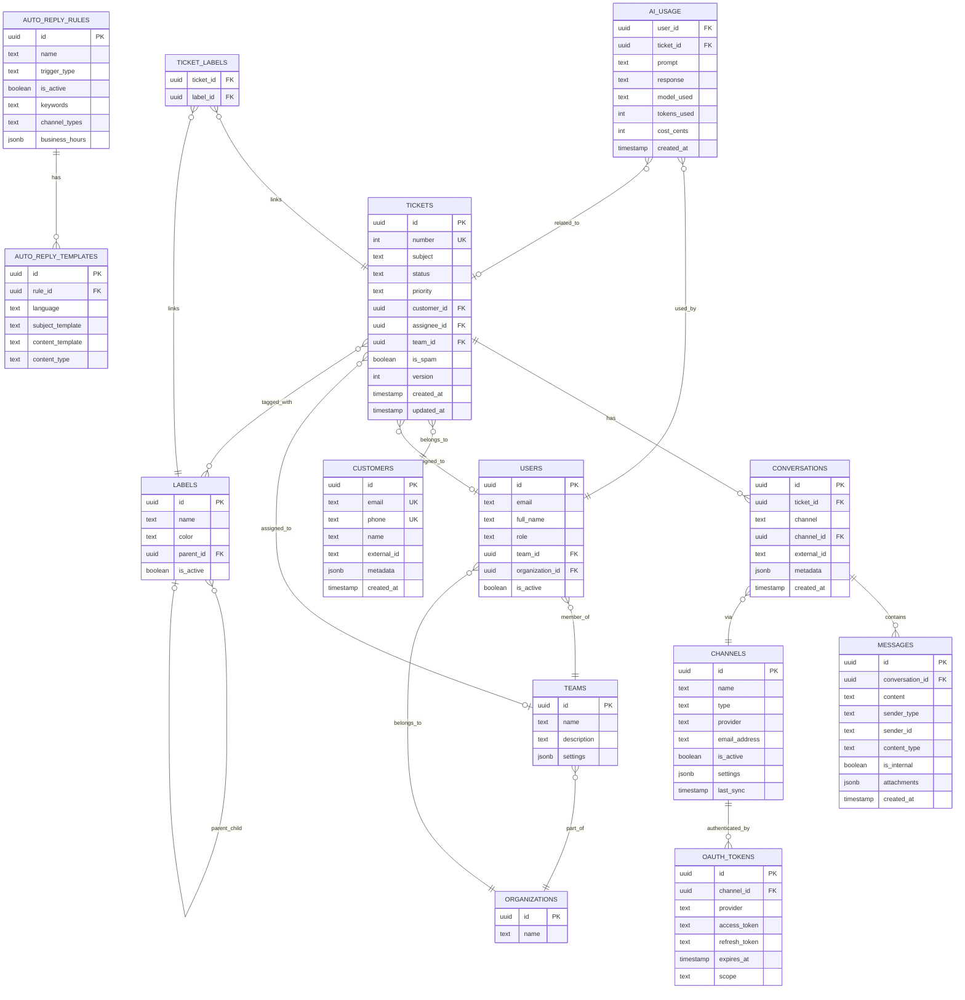

# Zynlo Helpdesk 🎫

Een modern ticketsysteem geïnspireerd door Trengo, gebouwd met cutting-edge technologieën voor optimale performance en schaalbaarheid.


## ✨ Features

- **📧 Gmail Integration**: Volledige email-naar-ticket conversie met OAuth2
- **📬 Multi-channel Support**: Email, WhatsApp, Chat integratie
- **🎯 Intelligent Ticket Routing**: Automatische ticket toewijzing
- **👥 Team Collaboration**: Interne notities en team management
- **🏷️ Label System**: Flexibele categorisatie van tickets
- **📊 Real-time Updates**: Live updates via WebSockets
- **🔍 Advanced Search**: Full-text search met filters
- **📱 Responsive Design**: Werkt perfect op alle apparaten
- **🔒 Enterprise Security**: Row Level Security (RLS) met Supabase

## 🆕 Recent Updates

### ✅ Gmail Integration Voltooid (December 2024)

- **Email-to-Ticket Conversie**: Automatische conversie van emails naar tickets
- **OAuth2 Authentication**: Veilige Gmail account koppeling
- **Smart Customer Management**: Automatische klant detectie en aanmaak
- **Duplicate Detection**: Voorkomt dubbele ticket creatie
- **Real-time Sync**: Live email synchronisatie met Gmail API
- **Push Notifications**: Instant email sync via Google Cloud Pub/Sub (< 1 seconde)
- **Comprehensive Metadata**: Behoudt alle email headers en content

### 🔧 Technische Verbeteringen

- Volledige Next.js API route implementatie
- Database schema voor OAuth token storage
- Robuuste error handling en logging
- Token refresh mechanisme
- Channel management interface

## 🚀 Tech Stack

### Frontend

- **Next.js 14** - React framework met App Router
- **TypeScript** - Type-safe development
- **Tailwind CSS** - Utility-first CSS framework
- **Radix UI** - Toegankelijke UI componenten
- **React Query** - Data synchronisatie

### Backend

- **Supabase** - PostgreSQL database & Auth
- **Gmail API** - Email synchronisatie en OAuth2
- **Edge Functions** - Serverless functies

### Integraties

- **Google OAuth2** - Gmail account authenticatie
- **Gmail API v1** - Email fetching en real-time sync
- **Automated Token Management** - Refresh token handling

### Development

- **Turborepo** - Monorepo management
- **pnpm** - Snelle package manager
- **ESLint & Prettier** - Code quality

## 📦 Project Structuur

```
zynlo-helpdesk/
├── 📁 .cursor/                     # Cursor IDE configuratie
│   └── mcp.json                    # MCP (Model Context Protocol) configuratie
├── 📁 .git/                       # Git repository data
├── 📁 .husky/                     # Git hooks voor code quality
├── 📁 .roo/                       # Roo AI configuratie
├── 📁 .turbo/                     # Turborepo cache
├── 📁 .vercel/                    # Vercel deployment configuratie
├── 📁 .vscode/                    # VS Code workspace instellingen
│
├── 📁 apps/                       # Applicaties
│   ├── 📁 dashboard/              # 🎯 Next.js Frontend Dashboard
│   │   ├── 📁 .next/              # Next.js build output
│   │   ├── 📁 .turbo/             # Turborepo cache voor dashboard
│   │   ├── 📁 .vercel/            # Vercel deployment voor dashboard
│   │   ├── 📁 app/                # Next.js App Router
│   │   │   ├── 📁 (auth)/         # Auth route groep
│   │   │   ├── 📁 api/            # API routes
│   │   │   ├── 📁 dashboard/      # Dashboard paginas
│   │   │   ├── 📁 inbox/          # Inbox/ticket management
│   │   │   ├── 📁 settings/       # Instellingen paginas
│   │   │   ├── globals.css        # Globale CSS
│   │   │   ├── layout.tsx         # Root layout
│   │   │   └── page.tsx           # Homepage
│   │   ├── 📁 components/         # React componenten
│   │   │   ├── 📁 ui/             # Base UI componenten
│   │   │   ├── 📁 forms/          # Form componenten
│   │   │   ├── 📁 layout/         # Layout componenten
│   │   │   └── message-content.tsx # Message rendering (met HTTPS sanitizer)
│   │   ├── 📁 hooks/              # Custom React hooks
│   │   ├── 📁 lib/                # Utility libraries
│   │   │   ├── html-optimizer.ts  # 🔧 HTML sanitizer voor HTTPS conversie
│   │   │   ├── supabase.ts        # Supabase client configuratie
│   │   │   └── utils.ts           # Algemene utilities
│   │   ├── 📁 public/             # Statische bestanden
│   │   ├── 📁 scripts/            # Build en deployment scripts
│   │   ├── 📁 services/           # API service layers
│   │   ├── 📁 types/              # TypeScript type definities
│   │   ├── middleware.ts          # Next.js middleware
│   │   ├── next.config.js         # Next.js configuratie
│   │   ├── package.json           # Dependencies voor dashboard
│   │   ├── tailwind.config.ts     # Tailwind CSS configuratie
│   │   └── tsconfig.json          # TypeScript configuratie
│   │
│   └── 📁 api-server/             # 🚀 Express.js Backend API
│       ├── 📁 .turbo/             # Turborepo cache voor API
│       ├── 📁 dist/               # Compiled JavaScript output
│       ├── 📁 node_modules/       # Node.js dependencies
│       ├── 📁 routes/             # Express route handlers
│       ├── 📁 services/           # Business logic services
│       ├── 📁 src/                # TypeScript source code
│       ├── 📁 types/              # TypeScript type definities
│       ├── 📁 utils/              # Utility functies
│       ├── package.json           # Dependencies voor API server
│       ├── tsconfig.json          # TypeScript configuratie
│       └── README.md              # API server documentatie
│
├── 📁 packages/                   # 📦 Gedeelde packages (monorepo)
│   ├── 📁 supabase/              # Supabase types en hooks
│   ├── 📁 ui/                    # Gedeelde UI componenten
│   └── 📁 utils/                 # Gedeelde utility functies
│
├── 📁 supabase/                   # 🗄️ Supabase configuratie
│   ├── 📁 functions/             # Edge Functions (serverless)
│   ├── 📁 migrations/            # Database schema migraties
│   └── config.toml               # Supabase project configuratie
│
├── 📁 docs/                       # 📚 Project documentatie
├── 📁 hooks/                      # Git hooks
├── 📁 scripts/                    # Project-wide scripts
├── 📁 tasks/                      # Task definitie bestanden
│
├── 📄 Configuratie bestanden:
├── .cursorrules                   # Cursor AI regels
├── .eslintrc.json                # ESLint configuratie
├── .gitignore                     # Git ignore regels
├── .npmrc                         # NPM configuratie
├── .prettierrc                    # Prettier code formatting
├── .roomodes                      # Room modes configuratie
├── .taskmasterconfig             # Taskmaster configuratie
├── .windsurfrules                # Windsurf AI regels
├── docker-compose.yml            # Docker services definitie
├── package.json                  # Root package.json (workspace)
├── pnpm-lock.yaml               # PNPM lockfile
├── pnpm-workspace.yaml          # PNPM workspace configuratie
├── tsconfig.json                # Root TypeScript configuratie
├── turbo.json                   # Turborepo configuratie
├── vercel.json                  # Vercel deployment configuratie
│
├── 📄 Deployment & Scripts:
├── deploy-to-vercel.ps1         # PowerShell deployment script
├── deploy-vercel.sh             # Bash deployment script
├── test-gmail-sync.ps1          # Gmail sync test script
│
└── 📄 Documentatie:
    ├── README.md                 # 📖 Hoofddocumentatie (dit bestand)
    ├── CONSOLE_ERRORS_FIX.md    # Console errors troubleshooting
    ├── EMAIL_SETUP_GUIDE.md     # Email setup instructies
    ├── GMAIL_OAUTH_SETUP.md     # Gmail OAuth configuratie
    ├── GMAIL_OAUTH_QUICK_START.md # Snelle Gmail setup
    ├── GMAIL_OAUTH_PRODUCTION_SETUP.md # Productie Gmail setup
    ├── MCP_SETUP_GUIDE.md       # MCP setup instructies
    ├── MCP_WERKT_NIET_OPLOSSING.md # MCP troubleshooting
    ├── OAUTH_SETUP_INSTRUCTIONS.md # OAuth setup instructies
    ├── TASKS.md                 # Project taken overzicht
    ├── email-management-features.md # Email management features
    ├── fix-email-sync.md        # Email sync fixes
    ├── fix-ticket-messages.md   # Ticket message fixes
    ├── performance-optimization.md # Performance optimalisaties
    └── project-completion.md    # Project voltooiing status
```

### 🏗️ Architectuur Overzicht

- **Frontend**: Next.js 14 met App Router, TypeScript, Tailwind CSS
- **Backend**: Express.js API server + Supabase Edge Functions
- **Database**: PostgreSQL via Supabase met Row Level Security
- **Monorepo**: Turborepo voor efficiënte builds en caching
- **Deployment**: Vercel voor frontend, Supabase voor backend
- **Package Management**: pnpm workspaces voor dependency management

## 🗄️ Database Structuur (Supabase)

### 📊 Core Entiteiten

#### 🎫 **Tickets** (tickets)

**Functie**: Hoofdentiteit voor alle support tickets

- `id` (uuid, PK): Unieke ticket identifier
- `number` (int, unique): Ticket nummer voor gebruikers (#1001, #1002, etc.)
- `subject` (text): Onderwerp van het ticket
- `status` (enum): new, open, pending, resolved, closed
- `priority` (enum): low, normal, high, urgent
- `customer_id` (uuid, FK): Verwijzing naar klant
- `assignee_id` (uuid, FK): Toegewezen agent
- `team_id` (uuid, FK): Toegewezen team
- `is_spam` (boolean): Spam detectie status
- `version` (int): Optimistic locking voor concurrent editing

#### 👥 **Customers** (customers)

**Functie**: Klantgegevens en contactinformatie

- `id` (uuid, PK): Unieke klant identifier
- `email` (text, unique): Email adres van klant
- `phone` (text, unique): Telefoonnummer
- `name` (text): Volledige naam
- `external_id` (text): Externe referentie ID
- `metadata` (jsonb): Flexibele extra data

#### 💬 **Messages** (messages)

**Functie**: Alle berichten binnen conversations

- `id` (uuid, PK): Unieke bericht identifier
- `conversation_id` (uuid, FK): Gekoppelde conversatie
- `content` (text): Bericht inhoud
- `sender_type` (enum): customer, agent, system
- `sender_id` (text): ID van afzender
- `content_type` (text): text/plain, text/html, text/markdown
- `is_internal` (boolean): Interne notitie of klant-zichtbaar
- `attachments` (jsonb[]): Bijlagen metadata

#### 🔄 **Conversations** (conversations)

**Functie**: Groepeert messages per kanaal/thread

- `id` (uuid, PK): Unieke conversatie identifier
- `ticket_id` (uuid, FK): Gekoppeld ticket
- `channel` (enum): email, whatsapp, chat, phone, api
- `channel_id` (uuid, FK): Specifiek kanaal (bijv. Gmail account)
- `external_id` (text): Externe thread ID
- `metadata` (jsonb): Kanaal-specifieke data

### 📡 Kanaal Management

#### 📧 **Channels** (channels)

**Functie**: Configuratie van communicatiekanalen

- `id` (uuid, PK): Unieke kanaal identifier
- `name` (text): Kanaal naam (bijv. "Support Gmail")
- `type` (enum): email, whatsapp, chat, phone, api
- `provider` (text): gmail, outlook, other
- `email_address` (text): Email adres voor email kanalen
- `is_active` (boolean): Kanaal status
- `settings` (jsonb): Kanaal-specifieke instellingen
- `last_sync` (timestamp): Laatste synchronisatie

#### 🔐 **OAuth Tokens** (oauth_tokens)

**Functie**: OAuth authenticatie voor externe services

- `id` (uuid, PK): Unieke token identifier
- `channel_id` (uuid, FK): Gekoppeld kanaal
- `provider` (text): gmail, outlook, other
- `access_token` (text): OAuth access token
- `refresh_token` (text): OAuth refresh token
- `expires_at` (timestamp): Token vervaldatum
- `scope` (text): OAuth scope permissies

### 👤 Gebruikers & Teams

#### 🧑‍💼 **Users** (users)

**Functie**: Agent/gebruiker accounts en profielen

- `id` (uuid, PK): Unieke gebruiker identifier (sync met auth.users)
- `email` (text): Email adres
- `full_name` (text): Volledige naam
- `role` (text): agent, admin, manager
- `team_id` (uuid, FK): Toegewezen team
- `organization_id` (uuid, FK): Organisatie membership
- `is_active` (boolean): Account status

#### 👥 **Teams** (teams)

**Functie**: Team organisatie en instellingen

- `id` (uuid, PK): Unieke team identifier
- `name` (text): Team naam
- `description` (text): Team beschrijving
- `settings` (jsonb): Team-specifieke instellingen

#### 🏢 **Organizations** (organizations)

**Functie**: Multi-tenant organisatie structuur

- `id` (uuid, PK): Unieke organisatie identifier
- `name` (text): Organisatie naam

#### 👥 **Team Members** (team_members)

**Functie**: Many-to-many relatie tussen users en teams

- `team_id` (uuid, FK): Team referentie
- `user_id` (uuid, FK): Gebruiker referentie
- `role` (text): member, leader

### 🤖 AI & Automatisering

#### 🔄 **Auto Reply Rules** (auto_reply_rules)

**Functie**: Automatische antwoord regels en triggers

- `id` (uuid, PK): Unieke regel identifier
- `name` (text): Regel naam
- `trigger_type` (text): first_message, keyword_match, out_of_hours
- `is_active` (boolean): Regel status
- `keywords` (text[]): Trigger keywords
- `channel_types` (text[]): Actieve kanalen
- `business_hours` (jsonb): Werkuren configuratie

#### 📝 **Auto Reply Templates** (auto_reply_templates)

**Functie**: Template content voor automatische antwoorden

- `id` (uuid, PK): Unieke template identifier
- `rule_id` (uuid, FK): Gekoppelde regel
- `language` (text): Template taal (nl, en, etc.)
- `subject_template` (text): Email onderwerp template
- `content_template` (text): Bericht content template
- `content_type` (text): text/plain, text/html

#### 🎯 **Auto Reply Conditions** (auto_reply_conditions)

**Functie**: Specifieke condities voor regel triggers

- `rule_id` (uuid, FK): Gekoppelde regel
- `field` (text): Veld om te checken
- `operator` (text): equals, contains, starts_with, etc.
- `value` (jsonb): Waarde om tegen te checken

#### 📊 **Auto Reply Execution Logs** (auto_reply_execution_logs)

**Functie**: Audit trail van uitgevoerde automatische antwoorden

- `rule_id` (uuid, FK): Uitgevoerde regel
- `ticket_id` (uuid, FK): Betreffende ticket
- `conditions_met` (boolean): Of condities waren voldaan
- `response_sent` (boolean): Of antwoord is verzonden
- `execution_time_ms` (int): Uitvoeringstijd

### 🧠 AI Features

#### 🤖 **AI Usage** (ai_usage)

**Functie**: Tracking van AI model gebruik per gebruiker

- `user_id` (uuid, FK): Gebruiker die AI gebruikte
- `ticket_id` (uuid, FK): Betreffende ticket
- `prompt` (text): AI prompt
- `response` (text): AI antwoord
- `model_used` (text): Gebruikt AI model
- `tokens_used` (int): Aantal gebruikte tokens
- `cost_cents` (int): Kosten in centen

#### 📈 **AI Usage Summary** (ai_usage_summary)

**Functie**: Maandelijkse AI gebruik samenvatting

- `user_id` (uuid, FK): Gebruiker
- `month` (date): Maand van gebruik
- `total_requests` (int): Totaal aantal requests
- `total_tokens` (int): Totaal aantal tokens
- `total_cost_cents` (int): Totale kosten

#### ⚙️ **AI Settings** (ai_settings)

**Functie**: Globale AI configuratie instellingen

- `setting_key` (text, unique): Instelling naam
- `setting_value` (jsonb): Instelling waarde
- `updated_by` (uuid, FK): Laatst gewijzigd door

### 🏷️ Labeling & Categorisatie

#### 🏷️ **Labels** (labels)

**Functie**: Flexibele ticket categorisatie

- `id` (uuid, PK): Unieke label identifier
- `name` (text): Label naam
- `color` (text): Hex kleur code
- `parent_id` (uuid, FK): Hiërarchische labels
- `is_active` (boolean): Label status

#### 🔗 **Ticket Labels** (ticket_labels)

**Functie**: Many-to-many koppeling tussen tickets en labels

- `ticket_id` (uuid, FK): Ticket referentie
- `label_id` (uuid, FK): Label referentie

### 📋 Taken & Workflow

#### ✅ **Tasks** (tasks)

**Functie**: Interne taken gekoppeld aan tickets

- `id` (uuid, PK): Unieke taak identifier
- `title` (text): Taak titel
- `description` (text): Taak beschrijving
- `status` (text): todo, in_progress, done, cancelled
- `priority` (text): low, normal, high, urgent
- `ticket_id` (uuid, FK): Gekoppeld ticket
- `due_date` (timestamp): Deadline

#### 👤 **Task Assignees** (task_assignees)

**Functie**: Taak toewijzingen aan gebruikers

- `task_id` (uuid, FK): Taak referentie
- `user_id` (uuid, FK): Toegewezen gebruiker

### 🔔 Notificaties & Communicatie

#### 🔔 **Notifications** (notifications)

**Functie**: In-app notificaties voor gebruikers

- `user_id` (uuid, FK): Ontvanger
- `ticket_id` (uuid, FK): Gerelateerd ticket
- `type` (text): Notificatie type
- `title` (text): Notificatie titel
- `message` (text): Notificatie bericht
- `is_read` (boolean): Gelezen status
- `action_url` (text): Deep link naar relevante pagina

#### 📧 **Email Templates** (email_templates)

**Functie**: Herbruikbare email templates

- `name` (text): Template naam
- `subject` (text): Email onderwerp
- `html_content` (text): HTML email content
- `text_content` (text): Plain text versie
- `variables` (jsonb): Template variabelen

### 📊 Analytics & Logging

#### 📈 **Activity Logs** (activity_logs)

**Functie**: Audit trail van alle ticket wijzigingen

- `ticket_id` (uuid, FK): Betreffende ticket
- `user_id` (uuid, FK): Gebruiker die actie uitvoerde
- `action_type` (text): Type actie (status_change, assignment, etc.)
- `action_description` (text): Beschrijving van actie
- `old_value` (text): Vorige waarde
- `new_value` (text): Nieuwe waarde

#### 🕒 **User Presence** (user_presence)

**Functie**: Real-time gebruiker status tracking

- `user_id` (uuid, FK): Gebruiker
- `status` (text): online, offline, away
- `current_page` (text): Huidige pagina
- `current_ticket_id` (uuid, FK): Huidig bekeken ticket
- `last_seen` (timestamp): Laatst actief

#### 📊 **System Logs** (system_logs)

**Functie**: Algemene systeem logging

- `level` (text): info, warning, error
- `message` (text): Log bericht
- `metadata` (jsonb): Extra context data

### 🛡️ Spam & Security

#### 🛡️ **Spam Detection Logs** (spam_detection_logs)

**Functie**: Spam detectie resultaten en audit

- `ticket_id` (uuid, FK): Betreffende ticket
- `email_from` (text): Afzender email
- `spam_score` (numeric): Spam score (0-1)
- `is_spam` (boolean): Spam classificatie
- `false_positive` (boolean): Handmatige correctie

#### 🚫 **Spam Filters** (spam_filters)

**Functie**: Configureerbare spam filter regels

- `rule_type` (text): email, domain, keyword, pattern
- `value` (text): Filter waarde
- `is_active` (boolean): Filter status

### 🔐 Authenticatie & Sessies

#### 🔐 **Login Sessions** (login_sessions)

**Functie**: Gebruiker login tracking en security

- `user_id` (uuid, FK): Ingelogde gebruiker
- `ip_address` (inet): IP adres
- `user_agent` (text): Browser informatie
- `success` (boolean): Login succesvol
- `country` (text): Land van login
- `device_type` (text): Apparaat type

### 📚 Overige Functies

#### 💾 **Saved Views** (saved_views)

**Functie**: Opgeslagen ticket filters en weergaven

- `name` (text): Weergave naam
- `user_id` (uuid, FK): Eigenaar (of null voor team)
- `filters` (jsonb): Filter configuratie
- `sort_order` (jsonb): Sorteer instellingen
- `columns` (jsonb): Zichtbare kolommen

#### 💬 **Message Drafts** (message_drafts)

**Functie**: Opgeslagen concept berichten

- `ticket_id` (uuid, FK): Betreffende ticket
- `user_id` (uuid, FK): Auteur van concept
- `content` (text): Concept inhoud
- `is_internal` (boolean): Interne notitie of klant bericht

#### 🔄 **Webhook Logs** (webhook_logs)

**Functie**: Inkomende webhook data logging

- `channel` (text): Webhook bron kanaal
- `payload` (jsonb): Webhook data
- `processed` (boolean): Verwerkings status
- `error` (text): Eventuele foutmelding

### 🔗 Database Relaties

**Belangrijkste relaties:**

- `tickets` ↔ `customers` (Many-to-One)
- `tickets` ↔ `conversations` (One-to-Many)
- `conversations` ↔ `messages` (One-to-Many)
- `tickets` ↔ `users` (assignee, Many-to-One)
- `tickets` ↔ `teams` (Many-to-One)
- `tickets` ↔ `labels` (Many-to-Many via `ticket_labels`)
- `channels` ↔ `oauth_tokens` (One-to-Many)
- `auto_reply_rules` ↔ `auto_reply_templates` (One-to-Many)
- `teams` ↔ `users` (Many-to-Many via `team_members`)

### 📊 Database Entity Relationship Diagram

Het volgende diagram toont de belangrijkste database entiteiten en hun relaties:



### 🛡️ Row Level Security (RLS)

**Beveiligingslaag:** Alle tabellen hebben RLS policies voor:

- Multi-tenant data isolatie per organisatie
- Role-based access control (admin, agent, etc.)
- User-specific data filtering (eigen drafts, notificaties, etc.)

**Performance:** Database is geoptimaliseerd met:

- Indexes op veelgebruikte query velden
- Partitioning voor grote tabellen (logs, activities)
- Materialized views voor analytics queries

## 🔌 MCP (Model Context Protocol) Integratie

### 📋 Overzicht

Het project gebruikt MCP voor naadloze integratie tussen AI tools (zoals Cursor), Taskmaster en Supabase. MCP biedt een gestandaardiseerde interface voor tool communicatie.

### 🛠️ Beschikbare MCP Tools

#### 📊 **Supabase MCP Tools**

- `mcp_supabase_list_projects`: Lijst alle Supabase projecten
- `mcp_supabase_get_project`: Project details ophalen
- `mcp_supabase_list_tables`: Database tabellen tonen
- `mcp_supabase_execute_sql`: SQL queries uitvoeren
- `mcp_supabase_apply_migration`: Database migraties toepassen
- `mcp_supabase_generate_typescript_types`: TypeScript types genereren
- `mcp_supabase_get_logs`: Service logs ophalen voor debugging

#### 🎯 **Taskmaster MCP Tools**

- `initialize_project`: Project initialisatie met Taskmaster
- `parse_prd`: Product Requirements Document parsen naar taken
- `get_tasks`: Taken lijst ophalen met filters
- `add_task`: Nieuwe taak toevoegen met AI
- `expand_task`: Taak opsplitsen in subtaken
- `set_task_status`: Taak status bijwerken
- `analyze_project_complexity`: Project complexiteit analyseren
- `models`: AI model configuratie beheren

#### 🐙 **GitHub MCP Tools**

- `mcp_github_get_file_contents`: Bestand inhoud ophalen
- `mcp_github_search_code`: Code zoeken in repositories
- `mcp_github_create_pull_request`: Pull request aanmaken
- `mcp_github_get_pull_request`: PR details ophalen
- `mcp_github_list_commits`: Commit geschiedenis

### ⚙️ MCP Configuratie

#### 📁 Configuratie Locatie

```
.cursor/mcp.json          # Cursor IDE MCP configuratie
```

#### 🔑 Environment Variables (in mcp.json)

```json
{
  "env": {
    "SUPABASE_URL": "https://nkrytssezaefinbjgwnq.supabase.co",
    "SUPABASE_ANON_KEY": "eyJ...",
    "SUPABASE_SERVICE_ROLE_KEY": "eyJ...",
    "ANTHROPIC_API_KEY": "sk-ant-...",
    "GITHUB_TOKEN": "ghp_..."
  }
}
```

#### 🎯 Tool Categorieën

1. **Database Management**: Supabase operaties, schema wijzigingen
2. **Task Management**: Taskmaster workflow, project planning
3. **Code Management**: GitHub integratie, code review
4. **AI Integration**: Model configuratie, usage tracking

### 🔄 Workflow Integratie

#### 📈 **Development Workflow via MCP**

1. **Project Setup**: `initialize_project` → `parse_prd`
2. **Task Planning**: `get_tasks` → `analyze_project_complexity` → `expand_task`
3. **Implementation**: `set_task_status` → code changes → `mcp_github_create_pull_request`
4. **Database Changes**: `mcp_supabase_apply_migration` → `mcp_supabase_generate_typescript_types`
5. **Monitoring**: `mcp_supabase_get_logs` → debugging

#### 🎯 **Praktische Voordelen**

- **Geïntegreerde Workflow**: Alles vanuit één interface (Cursor)
- **Automatisering**: Repetitieve taken via MCP tools
- **Consistentie**: Gestandaardiseerde tool interfaces
- **Traceability**: Alle acties via MCP zijn traceerbaar
- **Error Handling**: Robuuste foutafhandeling via MCP protocol

### 📚 MCP Best Practices

#### ✅ **Do's**

- Gebruik MCP tools voor alle database operaties
- Combineer tools voor complexe workflows
- Valideer inputs voordat MCP tools aanroepen
- Log MCP tool usage voor debugging

#### ❌ **Don'ts**

- Geen directe database calls bypassen MCP
- Geen gevoelige data in MCP logs
- Geen MCP tools parallel aanroepen zonder coordinatie
- Geen MCP configuratie hardcoden in code

## 🛠️ Installatie

### Vereisten

- Node.js 18+
- pnpm 8+
- Supabase account
- (Optioneel) Docker voor lokale Supabase

### Setup

1. **Clone de repository**

   ```bash
   git clone https://github.com/Garage-loyalty/zynlo.git
   cd zynlo
   ```

2. **Installeer dependencies**

   ```bash
   pnpm install
   ```

3. **Configureer environment variables**

   ```bash
   cp apps/dashboard/.env.example apps/dashboard/.env.local
   cp apps/api-server/.env.example apps/api-server/.env.local
   ```

4. **Setup Supabase**

   ```bash
   # Start lokale Supabase (optioneel)
   npx supabase start

   # Of gebruik Supabase cloud en voer migraties uit
   npx supabase db push
   ```

5. **Start development servers**
   ```bash
   pnpm dev
   ```

## 🔧 Configuratie

### Environment Variables

#### Dashboard (`apps/dashboard/.env.local`)

```env
NEXT_PUBLIC_SUPABASE_URL=your-supabase-url
NEXT_PUBLIC_SUPABASE_ANON_KEY=your-supabase-anon-key
NEXT_PUBLIC_APP_URL=http://localhost:3000

# Gmail Integration (Required voor email sync)
GOOGLE_CLIENT_ID=your-google-oauth-client-id
GOOGLE_CLIENT_SECRET=your-google-oauth-client-secret
SUPABASE_SERVICE_ROLE_KEY=your-supabase-service-role-key
```

#### Vercel Environment Variables

Voor productie deployment in Vercel:

```env
NEXT_PUBLIC_SUPABASE_URL=your-supabase-url
NEXT_PUBLIC_SUPABASE_ANON_KEY=your-supabase-anon-key
GOOGLE_CLIENT_ID=your-google-oauth-client-id
GOOGLE_CLIENT_SECRET=your-google-oauth-client-secret
SUPABASE_SERVICE_ROLE_KEY=your-supabase-service-role-key
```

## 📧 Gmail Integration Setup

### 1. Google Cloud Console Setup

1. Ga naar [Google Cloud Console](https://console.cloud.google.com)
2. Maak een nieuw project of selecteer een bestaand project
3. Ga naar "APIs & Services" → "Credentials"
4. Maak een OAuth 2.0 Client ID:
   - Application type: Web application
   - Authorized redirect URIs:
     - `http://localhost:3000/api/auth/gmail/callback` (development)
     - `https://your-domain.vercel.app/api/auth/gmail/callback` (production)

### 2. Database Setup

De oauth_tokens tabel wordt automatisch aangemaakt via migrations:

```sql
-- Zie: supabase/migrations/20241221000000_create_oauth_tokens.sql
-- Zie: supabase/migrations/20241221000001_update_channels_add_created_by.sql
```

### 3. Gmail Account Koppelen

1. Ga naar "Kanalen" in je helpdesk
2. Klik op "Email Kanaal Toevoegen"
3. Kies "Gmail" als provider
4. Klik "Koppel Gmail Account"
5. Voltooi de OAuth flow
6. Test de sync met "Sync Nu"

### 4. Email-naar-Ticket Proces


## 🔌 Integraties

### Email Setup ✅ Compleet

- **Gmail API Integration**: Volledig geïmplementeerd
- **OAuth2 Flow**: Veilige account koppeling
- **Real-time Sync**: Automatische email-naar-ticket conversie
- **Customer Management**: Auto-detect en creatie van klanten
- **Duplicate Prevention**: Voorkomt dubbele ticket processing

Zie [EMAIL_INTEGRATION.md](docs/EMAIL_INTEGRATION.md) voor gedetailleerde technische documentatie.

### WhatsApp Setup (Geplanned)

1. Configureer Twilio account
2. Set webhook URL naar `https://your-domain.com/api/webhooks/whatsapp`
3. Voeg credentials toe aan environment variables

## 🚀 Deployment

### Vercel (Aanbevolen)

1. Connect GitHub repository (`zynlo-helpdesk-fixed`)
2. Configure environment variables (zie bovenstaande lijst)
3. Deploy met één klik
4. Test Gmail integration na deployment

### Troubleshooting Gmail Integration

**"Gmail tokens niet gevonden":**

- Check of OAuth flow is voltooid
- Verifieer GOOGLE_CLIENT_ID en GOOGLE_CLIENT_SECRET
- Controleer redirect URIs in Google Cloud Console

**"Token refresh failed":**

- Check of refresh token bestaat in database
- Verifieer SUPABASE_SERVICE_ROLE_KEY is ingesteld
- Re-koppel Gmail account indien nodig

**Emails worden niet gesynchroniseerd:**

- Check Supabase logs in dashboard
- Verifieer dat channel status "Verbonden" toont
- Test sync handmatig via "Sync Nu" knop

### Docker

```bash
docker-compose up -d
```

## 📚 Documentatie

- [Architectuur Overzicht](docs/ARCHITECTURE.md)
- [Database Structuur](docs/DATABASE_STRUCTURE.md)
- [API Documentatie](docs/API.md)
- [Cursor AI Tips](docs/CURSOR_TIPS.md)

## 🤝 Contributing

Bijdragen zijn welkom! Zie onze [Contributing Guidelines](CONTRIBUTING.md).

## 📄 Licentie

Dit project is gelicentieerd onder de MIT License - zie het [LICENSE](LICENSE) bestand voor details.

## 🙏 Credits

- Geïnspireerd door [Trengo](https://trengo.com)
- Gebouwd met ❤️ door het Garage Loyalty team

---

**Need help?** Open een [issue](https://github.com/Garage-loyalty/zynlo/issues) of join onze [Discord](https://discord.gg/zynlo).

## 🚀 Deployment naar Vercel

### Prerequisites

- Vercel account
- GitHub repository
- Supabase project

### Stap 1: Voorbereiding

1. Zorg dat alle code gecommit is:

```bash
git add .
git commit -m "Prepare for Vercel deployment"
git push
```

2. Controleer dat de build lokaal werkt:

```bash
pnpm build
```

### Stap 2: Vercel Setup

1. Ga naar [vercel.com](https://vercel.com) en log in
2. Klik op "New Project"
3. Importeer je GitHub repository
4. Configureer het project:
   - **Framework Preset**: Next.js
   - **Root Directory**: `apps/dashboard`
   - **Build Command**: `cd ../.. && pnpm build`
   - **Install Command**: `pnpm install --frozen-lockfile`

### Stap 3: Environment Variables

Voeg de volgende environment variables toe in Vercel:

**Required:**

- `NEXT_PUBLIC_SUPABASE_URL` - Je Supabase project URL
- `NEXT_PUBLIC_SUPABASE_ANON_KEY` - Je Supabase anon key
- `SUPABASE_SERVICE_ROLE_KEY` - Je Supabase service role key

**Optional (voor extra features):**

- `GOOGLE_CLIENT_ID` - Voor Gmail integratie
- `GOOGLE_CLIENT_SECRET` - Voor Gmail integratie
- `EMAIL_WEBHOOK_SECRET` - Voor email webhook beveiliging

### Stap 4: Deploy

1. Klik op "Deploy"
2. Wacht tot de build compleet is
3. Je applicatie is nu live op `https://your-project.vercel.app`

### Troubleshooting

**Build faalt met "exit code 2":**

- Check of alle environment variables zijn ingesteld
- Controleer de build logs voor specifieke errors
- Zorg dat `typescript.ignoreBuildErrors: true` in `next.config.js` staat (tijdelijke fix)

**"Module not found" errors:**

- Run `pnpm clean && pnpm install` lokaal
- Commit de `pnpm-lock.yaml` file
- Push naar GitHub en trigger een nieuwe deploy

**Database connection errors:**

- Controleer of de Supabase URL en keys correct zijn
- Check of je Supabase project actief is
- Verifieer dat de database migrations zijn uitgevoerd

## 📝 Development Commands

```bash
# Development
pnpm dev              # Start alle services
pnpm dev:dashboard    # Start alleen dashboard
pnpm dev:api         # Start alleen API server

# Build & Production
pnpm build           # Build alle packages
pnpm start           # Start production servers
pnpm clean           # Clean build caches

# Database
pnpm supabase:start  # Start lokale Supabase
pnpm supabase:types  # Genereer TypeScript types

# Code Quality
pnpm lint            # Run linter
pnpm type-check      # Check TypeScript
pnpm format          # Format code
```

## 🤝 Contributing

1. Fork het project
2. Create je feature branch (`git checkout -b feature/AmazingFeature`)
3. Commit je changes (`git commit -m 'Add some AmazingFeature'`)
4. Push naar de branch (`git push origin feature/AmazingFeature`)
5. Open een Pull Request

## 📄 License

Dit project is gelicenseerd onder de MIT License.

## 🙏 Acknowledgments

- Geïnspireerd door [Trengo](https://trengo.com)
- Gebouwd met [Next.js](https://nextjs.org)
- Powered by [Supabase](https://supabase.com)

## 📝 Development Workflow

### Commands

```bash
# Development
pnpm dev              # Start alle services
pnpm dev:dashboard    # Start alleen dashboard

# Build & Production
pnpm build           # Build alle packages
pnpm start           # Start production servers
pnpm clean           # Clean build caches

# Database
pnpm supabase:start  # Start lokale Supabase
pnpm supabase:types  # Genereer TypeScript types

# Code Quality
pnpm lint            # Run linter
pnpm type-check      # Check TypeScript
pnpm format          # Format code
```

### Git Workflow

**⚡ Quick Check**: Run `.\scripts\check-git-setup-simple.ps1` (Windows) or `./scripts/check-git-setup.sh` (Mac/Linux) om je Git configuratie te verifiëren.

1. Maak een feature branch: `git checkout -b feature/nieuwe-feature`
2. Commit changes: `git commit -m "feat: beschrijving"`
3. Push branch: `git push origin feature/nieuwe-feature`
4. Open een Pull Request

**📖 Detailed Git Setup**: Zie [GIT_SETUP.md](docs/GIT_SETUP.md) voor complete instructies en troubleshooting.

## 📚 Documentatie

- [Architectuur Overzicht](docs/ARCHITECTURE.md)
- [Database Setup](docs/DATABASE_SETUP.md)
- [Email Integration](docs/EMAIL_INTEGRATION.md)
- [Project Status](docs/PROJECT_STATUS.md)
- [Git Setup Guide](docs/GIT_SETUP.md)

## 🚀 Deployment naar Vercel

### Prerequisites

- Vercel account gekoppeld aan GitHub
- Supabase project met migraties uitgevoerd
- Google Cloud Console OAuth2 credentials

### Stap 1: Repository Setup

1. Zorg dat alle code gecommit is:

```bash
git add .
git commit -m "Prepare for Vercel deployment"
git push origin main
```

2. Controleer dat de build lokaal werkt:

```bash
pnpm build
```

### Stap 2: Vercel Configuration

1. Ga naar [vercel.com](https://vercel.com) en log in
2. Klik op "New Project"
3. Importeer je GitHub repository (`zynlo-helpdesk-fixed`)
4. Configureer het project:
   - **Framework Preset**: Next.js
   - **Root Directory**: `apps/dashboard`
   - **Build Command**: `cd ../.. && pnpm build`
   - **Install Command**: `pnpm install --frozen-lockfile`

### Stap 3: Environment Variables

Voeg alle environment variables toe uit de configuratie sectie hierboven.

### Stap 4: Deploy & Test

1. Klik op "Deploy"
2. Test de Gmail integration na deployment
3. Verifieer dat emails correct worden geconverteerd naar tickets

## 🧪 Testing Gmail Integration

### Manual Test Procedure

1. Ga naar `https://your-domain.vercel.app/`
2. Navigeer naar "Kanalen" → je Gmail kanaal
3. Klik "Sync Nu" en wacht op groene success melding
4. Ga naar "Inbox" en controleer nieuwe tickets
5. Verifieer customer data en email content

### Expected Results

- ✅ Elke email wordt een uniek ticket
- ✅ Customer info wordt automatisch geëxtraheerd
- ✅ Email content wordt bewaard als message
- ✅ Duplicate emails worden genegeerd
- ✅ Metadata zoals headers worden opgeslagen

## 🤝 Contributing

Bijdragen zijn welkom! Zie onze [Contributing Guidelines](CONTRIBUTING.md).

1. Fork het project
2. Create je feature branch (`git checkout -b feature/AmazingFeature`)
3. Commit je changes (`git commit -m 'Add some AmazingFeature'`)
4. Push naar de branch (`git push origin feature/AmazingFeature`)
5. Open een Pull Request

## 📄 License

Dit project is gelicentieerd onder de MIT License - zie het [LICENSE](LICENSE) bestand voor details.

## 🙏 Credits

- Geïnspireerd door [Trengo](https://trengo.com)
- Gebouwd met ❤️ door het Garage Loyalty team
- Gmail API integratie development

---

**Need help?** Open een [issue](https://github.com/wasgeurtjeNL/zynlo-helpdesk-fixed/issues) of contacteer het development team.

**🚀 Ready to test?** De Gmail integratie is volledig functioneel en klaar voor productie gebruik!
