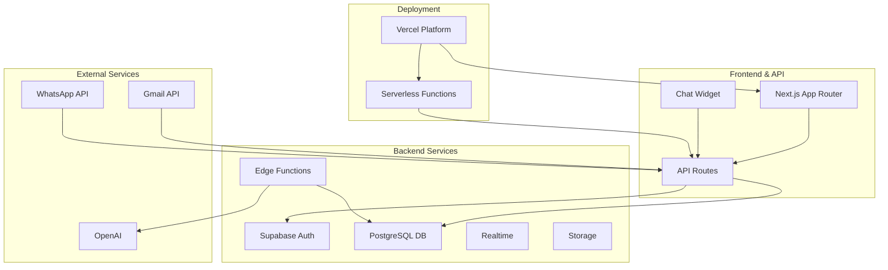

# Zynlo Helpdesk - Architecture Documentation

## 🏗️ System Architecture

### Overview
Zynlo Helpdesk is built as a modern, scalable ticketing system using a **Next.js full-stack architecture** with integrated API routes and Supabase backend services.

### **Current Architecture (December 2024)**


## 📦 Technology Stack

### Frontend & Backend (Unified)
- **Framework**: Next.js 14 (App Router) - Full-stack
- **API Layer**: Next.js API Routes (replaces Express.js)
- **UI Library**: React 18
- **Styling**: Tailwind CSS
- **Components**: Radix UI (headless)
- **State Management**: React Context + useState
- **Data Fetching**: Native fetch with SWR patterns
- **Forms**: React Hook Form + Zod
- **Notifications**: Sonner (Toast library)

### Backend Services
- **Database**: PostgreSQL (via Supabase)
- **Auth**: Supabase Auth
- **Realtime**: Supabase Realtime
- **Storage**: Supabase Storage
- **Edge Functions**: Supabase Edge Functions (Deno)

### Infrastructure
- **Hosting**: Vercel (Full-stack deployment)
- **Database**: Supabase Cloud
- **Monitoring**: Vercel Analytics
- **Serverless**: Vercel Functions (Node.js)

## 🔄 Data Flow

### 1. Incoming Message Flow (Updated)
```
External Channel → Next.js API Route → Supabase DB → Realtime → UI
```

### 2. OAuth Flow (Gmail Integration)
```
UI → /api/auth/gmail/connect → Google OAuth → /api/auth/gmail/callback → Dashboard
```

### 3. Sync Flow
```
UI → /api/sync/gmail/[channelId] → Database Update → Toast Feedback → UI Refresh
```

### 4. Authentication Flow
```
User → Next.js Auth → Supabase Auth → JWT → API Route Validation
```

## 🗄️ Database Schema

### Core Tables (Current)
- `channels` - Email/communication channels
  - `id, name, type, provider, settings, last_sync, created_at`
- `users` - System users (agents, admins)  
- `customers` - Customer profiles
- `tickets` - Support tickets
- `conversations` - Communication threads
- `messages` - Individual messages

### Current Schema Focus
The project currently focuses on the **channels** management system:
```sql
CREATE TABLE channels (
  id uuid PRIMARY KEY DEFAULT gen_random_uuid(),
  name text NOT NULL,
  type text NOT NULL, -- 'email', 'whatsapp', 'chat'
  provider text, -- 'gmail', 'outlook', etc.
  settings jsonb DEFAULT '{}',
  last_sync timestamptz,
  created_at timestamptz DEFAULT NOW(),
  updated_at timestamptz DEFAULT NOW()
);
```

## 🔐 Security Architecture

### Current Implementation
1. **OAuth 2.0**: Gmail integration with secure tokens
2. **Environment Variables**: Secrets management via Vercel
3. **Supabase RLS**: Row Level Security policies
4. **HTTPS Only**: Vercel enforces SSL

### Planned Security
1. **Token Encryption**: Encrypt stored OAuth tokens
2. **Rate Limiting**: Implement on sync endpoints
3. **Webhook Signatures**: Verify incoming webhooks
4. **RBAC**: Role-based access control

## 🚀 Deployment Architecture

### Current Production Setup
```yaml
Production (Vercel):
  Application:
    - Next.js full-stack app
    - Automatic scaling
    - Global edge network
    - Serverless functions
  
  Database:
    - Supabase managed PostgreSQL
    - Automatic backups
    - Real-time subscriptions
  
  Configuration:
    - Environment variables in Vercel
    - Automatic deployments from GitHub
    - Preview deployments for PRs
```

### Development Environment
```yaml
Local Development:
  - Next.js dev server (localhost:3000)
  - Supabase local development
  - Hot reload for all code changes
  - Environment variables in .env.local
```

## 📊 File Structure (Current)

```
zynlo-helpdesk/
├── apps/
│   ├── dashboard/                 # Main Next.js application
│   │   ├── app/
│   │   │   ├── api/              # API Routes (replaces Express API)
│   │   │   │   ├── auth/gmail/   # OAuth endpoints
│   │   │   │   └── sync/gmail/   # Sync functionality
│   │   │   ├── (dashboard)/      # Dashboard pages
│   │   │   │   └── kanalen/      # Channels management
│   │   │   └── layout.tsx        # Root layout
│   │   ├── components/           # React components
│   │   ├── lib/                  # Utilities and Supabase client
│   │   └── package.json
│   │
│   └── api-server/               # 🚫 DEPRECATED (not deployed)
│       └── (legacy code)
│
├── packages/
│   ├── ui/                       # Design system
│   ├── database/                 # Database utilities
│   └── shared/                   # Common utilities
│
├── supabase/
│   ├── migrations/               # Database migrations
│   └── functions/                # Edge functions
│
└── docs/                         # Documentation
```

## 🔄 API Routes (Next.js)

### Current Endpoints
```typescript
// OAuth Flow
GET    /api/auth/gmail/connect      // Start OAuth
GET    /api/auth/gmail/callback     // Handle OAuth callback

// Channel Management  
POST   /api/sync/gmail/[channelId]  // Manual sync trigger

// Future Endpoints (Planned)
GET    /api/channels                // List channels
POST   /api/channels                // Create channel
PUT    /api/channels/[id]           // Update channel
DELETE /api/channels/[id]           // Delete channel

POST   /api/tickets                 // Create ticket
GET    /api/tickets/[id]            // Get ticket details
```

## 📈 Current Status & Roadmap

### ✅ **Phase 1 - Infrastructure (Complete)**
- [x] Next.js 14 full-stack setup
- [x] Supabase integration
- [x] Vercel deployment
- [x] Basic UI with Tailwind
- [x] Channel management interface

### 🚧 **Phase 2 - Email Integration (In Progress)**
- [x] OAuth flow implementation
- [x] Database channel storage
- [x] UI feedback system
- [ ] Token storage & management
- [ ] Gmail API email fetching
- [ ] Email-to-ticket conversion

### 📋 **Phase 3 - Core Features (Planned)**
- [ ] Ticket management system
- [ ] Customer profiles
- [ ] Agent dashboard
- [ ] Message threading
- [ ] Real-time updates

### 🚀 **Phase 4 - Advanced Features (Future)**
- [ ] WhatsApp integration
- [ ] AI-powered responses
- [ ] Analytics dashboard
- [ ] Mobile responsiveness
- [ ] Multi-tenant support

## 🛠️ Development Workflow

### Current CI/CD
```yaml
1. Code Push → GitHub
2. Automatic Build → Vercel
3. Preview Deploy → PR environments
4. Production Deploy → main branch
5. Environment Variables → Vercel Dashboard
```

### Key Commands
```bash
# Development
pnpm dev                    # Start dev server
pnpm build                  # Build for production
pnpm start                  # Start production server

# Database
supabase db push            # Apply migrations
supabase gen types typescript  # Generate types
```

## 🔌 Integration Status

### ✅ **Currently Integrated**
- Gmail OAuth 2.0 authentication
- Supabase database operations
- Vercel deployment platform
- Sonner toast notifications

### 🚧 **In Development** 
- Gmail API email fetching
- Token refresh mechanism
- Webhook payload processing

### 📋 **Planned Integrations**
- WhatsApp Business API
- Outlook/Office 365
- Slack notifications
- SMS providers

## 🎯 Design Principles

1. **Full-Stack Simplicity**: Single Next.js app reduces complexity
2. **Serverless First**: Leverage Vercel's serverless platform
3. **Database Driven**: Supabase handles auth, storage, and real-time
4. **User Experience**: Fast feedback with optimistic updates
5. **Developer Experience**: Hot reload, TypeScript, clear structure

## 🔮 Migration Notes

### From Express API to Next.js API Routes
The project successfully migrated from a separate Express.js API server to Next.js API routes for several reasons:

1. **Simplified Deployment**: Single application instead of two services
2. **Better DX**: Shared code, types, and utilities
3. **Vercel Optimization**: Native Next.js support
4. **Reduced Complexity**: No need for CORS or cross-service communication

### Key Changes Made:
- Moved OAuth endpoints from Express to `/app/api/auth/gmail/`
- Converted sync endpoints to `/app/api/sync/gmail/[channelId]/`
- Updated frontend to use relative API calls
- Migrated from separate CORS configuration to Next.js built-in handling

---

This architecture prioritizes simplicity, developer experience, and scalability while leveraging modern full-stack patterns and serverless deployment. 