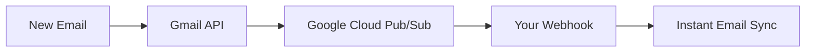

# Gmail Push Notifications (Real-time Email Sync)

Gmail Push Notifications provide **real-time email synchronization** using Google Cloud Pub/Sub instead of polling Gmail every 5 minutes. This dramatically improves user experience by delivering new emails to your helpdesk instantly.

## 🚀 Benefits

- **Real-time sync**: New emails appear instantly instead of waiting up to 5 minutes
- **Reduced API usage**: No more frequent polling requests to Gmail API
- **Better scalability**: Handles multiple Gmail accounts efficiently
- **Lower latency**: Average notification delivery: <1 second vs 2.5 minutes with polling

## 📋 How It Works

1. **Gmail Watch API**: Monitors Gmail inbox for changes
2. **Google Cloud Pub/Sub**: Receives notifications when new emails arrive
3. **Push Webhook**: Delivers notifications to your API server instantly
4. **Automatic Sync**: Triggers immediate email sync for the affected channel



## 🛠️ Setup Requirements

### Prerequisites

1. **Gmail OAuth2 already configured** (`GOOGLE_CLIENT_ID`, `GOOGLE_CLIENT_SECRET`)
2. **Google Cloud Console project** with Gmail API enabled
3. **Public webhook URL** (use ngrok for local development)

### Environment Variables

Add these to your `.env.local` file:

```bash
# Gmail Push Notifications
GOOGLE_CLOUD_PROJECT_ID=your-project-id
GMAIL_PUBSUB_TOPIC=gmail-notifications
GMAIL_PUSH_TOKEN=your-security-token  # Optional but recommended
```

## 🚀 Quick Setup

### Option 1: Interactive Setup Script

```bash
node scripts/setup-gmail-push-notifications.js
```

This script will:

- Check your current configuration
- Guide you through the setup process
- Update your `.env.local` file automatically

### Option 2: Manual Setup

#### Step 1: Enable Google Cloud Pub/Sub

1. Go to [Google Cloud Console](https://console.cloud.google.com)
2. Select your project (same as Gmail OAuth)
3. Enable the **Cloud Pub/Sub API**
4. Navigate to **Pub/Sub** → **Topics**
5. Click **Create Topic**
   - **Topic ID**: `gmail-notifications`
   - Leave other settings as default

#### Step 2: Create Push Subscription

1. In your topic, click **Create Subscription**
2. **Subscription ID**: `gmail-notifications-webhook`
3. **Delivery Type**: Push
4. **Endpoint URL**: `https://your-domain.com/webhooks/gmail-push`
   - For local development: `https://your-ngrok-url.ngrok.io/webhooks/gmail-push`
5. Click **Create**

#### Step 3: Configure Environment Variables

Update your `.env.local`:

```bash
GOOGLE_CLOUD_PROJECT_ID=your-project-id
GMAIL_PUBSUB_TOPIC=gmail-notifications
GMAIL_PUSH_TOKEN=your-random-security-token
```

#### Step 4: Restart API Server

```bash
pnpm restart
```

## 🔧 Local Development with ngrok

For local testing, you need a public URL for the webhook:

```bash
# Install ngrok
npm install -g ngrok

# Expose your local API server
ngrok http 3001

# Use the HTTPS URL for your Pub/Sub subscription
# Example: https://abc123.ngrok.io/webhooks/gmail-push
```

## 📊 Monitoring & Status

### Check Push Notification Status

```bash
# View status of all Gmail channels
curl http://localhost:3001/webhooks/gmail-push/status
```

### Setup Push Notifications for Specific Channel

```bash
# Enable push notifications for a channel
curl -X POST http://localhost:3001/webhooks/gmail-push/setup/CHANNEL_ID
```

### Stop Push Notifications

```bash
# Disable push notifications for a channel
curl -X POST http://localhost:3001/webhooks/gmail-push/stop/CHANNEL_ID
```

## 🔄 Automatic Management

The system automatically handles:

- **Startup Setup**: Push notifications are configured for all Gmail channels when server starts
- **Daily Renewal**: Cron job checks and renews expiring notifications (daily at 2 AM)
- **Error Handling**: Falls back to polling if push notifications fail
- **Token Refresh**: Automatically refreshes OAuth tokens when needed

## 🚨 Troubleshooting

### Common Issues

#### 1. Webhook Not Receiving Notifications

**Symptoms**: No real-time sync, still uses 5-minute polling

**Solutions**:

```bash
# Check if webhook URL is accessible
curl https://your-domain.com/webhooks/gmail-push

# Verify Pub/Sub subscription configuration
# Ensure webhook URL matches your actual server URL
```

#### 2. Push Notifications Expired

**Symptoms**: Logs show "Gmail watch stopped" or "expired"

**Solutions**:

- Push notifications expire every 7 days
- The system automatically renews them daily
- Manual renewal: restart the API server

#### 3. Permission Errors

**Symptoms**: 403 Forbidden errors in logs

**Solutions**:

```bash
# Ensure Gmail API and Pub/Sub API are enabled
# Check OAuth scopes include gmail.readonly
```

### Debug Logs

Enable detailed logging:

```bash
# Set log level to debug
DEBUG=gmail:* node apps/api-server/src/index.js
```

### Test Push Notifications

1. Send an email to your connected Gmail account
2. Check API server logs for:
   ```
   📧 Gmail Push Notification received
   🔄 Triggering sync for channel...
   ✅ Push notification sync completed
   ```
3. Verify email appears in dashboard within seconds

## 🔐 Security Considerations

### Webhook Token Validation

The webhook validates incoming requests using `GMAIL_PUSH_TOKEN`:

```bash
# Generate a secure random token
openssl rand -hex 32

# Add to .env.local
GMAIL_PUSH_TOKEN=your-generated-token
```

### IP Whitelisting (Optional)

For extra security, whitelist Google's Pub/Sub IP ranges in your firewall.

## 📈 Performance Impact

### Before (Polling)

- **Sync Frequency**: Every 5 minutes
- **Average Delay**: 2.5 minutes
- **API Calls**: 288 requests/day per channel
- **Resource Usage**: Continuous polling

### After (Push Notifications)

- **Sync Frequency**: Real-time
- **Average Delay**: <1 second
- **API Calls**: Only when emails arrive
- **Resource Usage**: Event-driven

## 🔧 Advanced Configuration

### Custom Topic Names

```bash
# Use different topic per environment
GMAIL_PUBSUB_TOPIC=gmail-notifications-production
GMAIL_PUBSUB_TOPIC=gmail-notifications-staging
```

### Service Account Authentication

For production, use a service account:

```bash
# Create service account in Google Cloud Console
# Download JSON key file
# Set environment variable
GOOGLE_APPLICATION_CREDENTIALS=/path/to/service-account.json
```

## 📚 Additional Resources

- [Gmail Push Notifications Guide](https://developers.google.com/gmail/api/guides/push)
- [Google Cloud Pub/Sub Documentation](https://cloud.google.com/pubsub/docs)
- [Push Subscription Configuration](https://cloud.google.com/pubsub/docs/push)

## 🆘 Support

If you encounter issues:

1. Check the troubleshooting section above
2. Review API server logs for error messages
3. Verify Google Cloud Console configuration
4. Test with the setup script: `node scripts/setup-gmail-push-notifications.js`

---

**💡 Pro Tip**: Gmail Push Notifications are the difference between a "good" and "great" helpdesk experience. Users expect real-time communication, and this implementation delivers exactly that!
